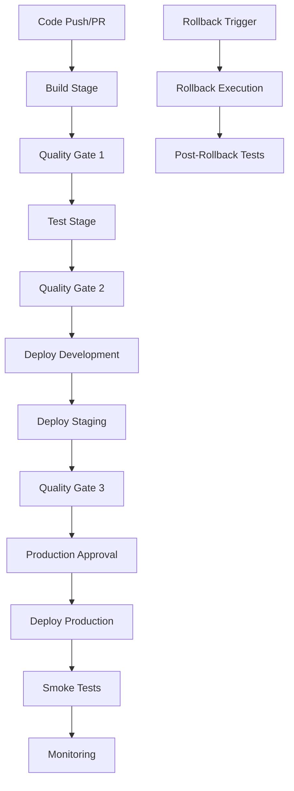

# Production-Ready CI/CD Pipeline Documentation

## Overview

This document describes the comprehensive CI/CD pipeline implementation for the API Testing Framework, featuring multi-stage deployments, quality gates, rollback strategies, and advanced monitoring capabilities.

## Table of Contents

- [Pipeline Architecture](#pipeline-architecture)
- [Workflow Files](#workflow-files)
- [Quality Gates](#quality-gates)
- [Environment Strategy](#environment-strategy)
- [Secrets Management](#secrets-management)
- [Deployment Scripts](#deployment-scripts)
- [Rollback Strategy](#rollback-strategy)
- [Monitoring & Notifications](#monitoring--notifications)
- [Usage Examples](#usage-examples)
- [Troubleshooting](#troubleshooting)

## Pipeline Architecture

### Multi-Stage Pipeline Flow



### Stage Breakdown

1. **Build Stage** (5-10 minutes)
   - Node.js environment setup
   - Dependency installation with caching
   - TypeScript compilation
   - Code quality checks (ESLint, Prettier)
   - Build artifact creation

2. **Test Stage** (10-20 minutes)
   - Parallel test execution across environments
   - Functional, integration, and advanced test suites
   - Test result aggregation and reporting
   - Performance metrics collection

3. **Deploy Stage** (5-15 minutes per environment)
   - Environment-specific configuration
   - Blue-green deployment strategy
   - Health checks and validation
   - Rollback on failure

## Workflow Files

### Primary Workflows

| File | Purpose | Trigger |
|------|---------|---------|
| `ci-cd-pipeline.yml` | Main CI/CD pipeline | Push to main/develop, PR |
| `deploy-production.yml` | Production deployment | Manual trigger |
| `rollback-production.yml` | Production rollback | Manual trigger |

### Workflow Features

- **Conditional Execution**: Based on branch, environment, and manual inputs
- **Matrix Strategy**: Parallel execution across multiple environments
- **Artifact Management**: Build artifacts shared across stages
- **Timeout Controls**: Prevents hanging workflows
- **Retry Logic**: Automatic retry for transient failures

## Quality Gates

### Gate 1: Build Quality
- TypeScript compilation successful
- Code linting passes (ESLint)
- Code formatting validated
- Security audit passes
- Build artifacts created

### Gate 2: Test Quality
- All functional tests pass
- All integration tests pass
- All advanced tests pass
- Test coverage meets threshold (80%+)
- Performance benchmarks met

### Gate 3: Deployment Quality
- Health checks pass
- Smoke tests successful
- Performance metrics within limits
- Security scans clean
- Monitoring alerts clear

## Environment Strategy

### Environment Configuration

| Environment | Purpose | Auto-Deploy | Approval Required |
|-------------|---------|-------------|-------------------|
| Development | Feature testing | Yes (develop branch) | No |
| Staging | Pre-production validation | Yes (main branch) | No |
| Production | Live environment | No | Yes (Manual) |

### Environment Variables

```bash
# Development
DEV_API_URL=https://dev-api.reqres.in
DEV_API_KEY=dev-api-key

# Staging
STAGING_API_URL=https://staging-api.reqres.in
STAGING_API_KEY=staging-api-key

# Production
PROD_API_URL=https://api.reqres.in
PROD_API_KEY=prod-api-key
```

## Secrets Management

### Required Secrets

| Secret Name | Description | Environments |
|-------------|-------------|--------------|
| `DEV_API_URL` | Development API URL | Development |
| `DEV_API_KEY` | Development API key | Development |
| `STAGING_API_URL` | Staging API URL | Staging |
| `STAGING_API_KEY` | Staging API key | Staging |
| `PROD_API_URL` | Production API URL | Production |
| `PROD_API_KEY` | Production API key | Production |
| `SLACK_WEBHOOK_URL` | Slack notifications | All |
| `DEPLOY_API_KEY` | Deployment service key | Production |

### Security Best Practices

- Use GitHub Secrets for sensitive data
- Rotate secrets regularly
- Limit secret access by environment
- Audit secret usage
- Use least privilege principle

## Deployment Scripts

### Available Scripts

| Script | Purpose | Usage |
|--------|---------|-------|
| `scripts/deploy.sh` | Environment deployment | `./deploy.sh -e staging -v v1.2.3` |
| `scripts/rollback.sh` | Environment rollback | `./rollback.sh -e prod -v v1.2.2 -r "Bug fix"` |
| `scripts/smoke-tests.sh` | Post-deployment validation | `./smoke-tests.sh -e production` |

### Script Features

- **Environment Validation**: Ensures target environment is valid
- **Version Verification**: Validates deployment version exists
- **Health Checks**: Comprehensive post-deployment validation
- **Logging**: Detailed execution logs
- **Notifications**: Slack/Teams integration
- **Rollback**: Automatic rollback on failure

## Rollback Strategy

### Rollback Triggers

1. **Automatic Rollback**
   - Health check failures
   - Smoke test failures
   - Performance degradation

2. **Manual Rollback**
   - Critical bugs discovered
   - Security vulnerabilities
   - Business requirements

### Rollback Process

1. **Pre-Rollback Validation**
   - Verify rollback version exists
   - Check rollback compatibility
   - Create current state backup

2. **Rollback Execution**
   - Stop current services
   - Deploy previous version
   - Update configuration
   - Restart services

3. **Post-Rollback Validation**
   - Health checks
   - Smoke tests
   - Performance validation
   - Monitoring verification

## Monitoring & Notifications

### Notification Channels

- **Slack**: Real-time pipeline status updates
- **Email**: Critical failure notifications
- **Teams**: Deployment summaries
- **GitHub**: PR status checks

### Monitoring Metrics

- **Build Time**: Track build performance
- **Test Duration**: Monitor test execution time
- **Deployment Time**: Track deployment speed
- **Success Rate**: Pipeline success percentage
- **Rollback Frequency**: Deployment stability metric

## Usage Examples

### Trigger Development Deployment

```bash
# Automatic trigger on push to develop branch
git push origin develop
```

### Manual Production Deployment

```bash
# Via GitHub Actions UI
# 1. Go to Actions tab
# 2. Select "Production Deployment"
# 3. Click "Run workflow"
# 4. Enter version and parameters
```

### Emergency Rollback

```bash
# Via GitHub Actions UI
# 1. Go to Actions tab
# 2. Select "Production Rollback"
# 3. Click "Run workflow"
# 4. Enter rollback version and reason
# 5. Check "Emergency" if needed
```

### Local Testing

```bash
# Test deployment script locally
./scripts/deploy.sh -e development -v main --dry-run

# Test rollback script locally
./scripts/rollback.sh -e development -v previous --dry-run -r "Testing"

# Run smoke tests locally
./scripts/smoke-tests.sh -e development
```

## Troubleshooting

### Common Issues

#### Build Failures

```bash
# Check Node.js version
node --version

# Clear npm cache
npm cache clean --force

# Reinstall dependencies
rm -rf node_modules package-lock.json
npm install
```

#### Test Failures

```bash
# Run tests locally
npm run test:all

# Debug specific test
npm run test:debug -- --grep "test-name"

# Check test environment
echo $NODE_ENV
echo $API_BASE_URL
```

#### Deployment Failures

```bash
# Check deployment logs
cat logs/deployment.log

# Verify environment configuration
./scripts/deploy.sh -e staging -v main --dry-run

# Test connectivity
curl -f https://staging-api.reqres.in/health
```

### Pipeline Debugging

1. **Check Workflow Logs**
   - Go to Actions tab in GitHub
   - Click on failed workflow
   - Expand failed step logs

2. **Verify Secrets**
   - Check secret names match exactly
   - Ensure secrets are set for correct environment
   - Verify secret values are correct

3. **Test Locally**
   - Run scripts locally with same parameters
   - Check environment variables
   - Verify network connectivity

### Support Contacts

- **Pipeline Issues**: DevOps Team
- **Test Failures**: QA Team
- **Deployment Issues**: Platform Team
- **Security Concerns**: Security Team

---

## Additional Resources

- [GitHub Actions Documentation](https://docs.github.com/en/actions)
- [Playwright Testing Guide](https://playwright.dev/docs/intro)
- [TypeScript Configuration](https://www.typescriptlang.org/docs/)
- [Docker Best Practices](https://docs.docker.com/develop/best-practices/)

---

*Last Updated: $(date)*
*Version: 1.0.0*
